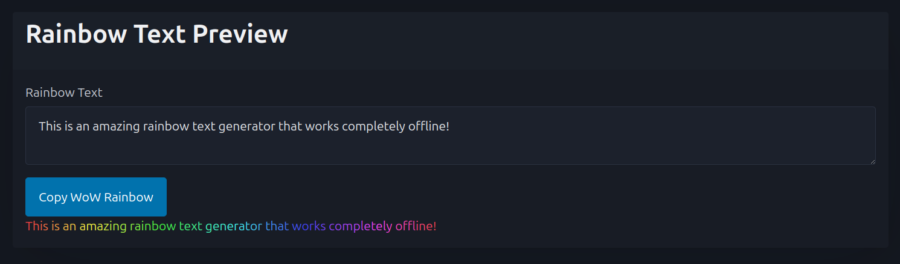

# WoW Rainbow Text Generator

A **privacy-focused**, **offline-capable** rainbow text generator for World of Warcraft. No data is sent to external servers - everything runs locally in your browser using JavaScript.

## 🌈 Features
- Generate rainbow-colored text for WoW chat, addon names, and addon text
- **100% client-side** - your text never leaves your browser
- **Fully offline** - includes all dependencies (Vue.js + Pico CSS)
- Clean, responsive interface using Pico CSS

## 🔗 Try it out
**Live Demo:** https://larsj02.github.io/wow-rainbowtext/

## 🔒 Why use this instead of online generators?
Unlike PHP-based online tools that send your text to external servers, this generator:
- Keeps your data completely private
- Works without any internet connection (download the repo)
- No server dependencies or data transmission

---
*Alternative to online generators like mgawow.online - built for privacy and offline use.*